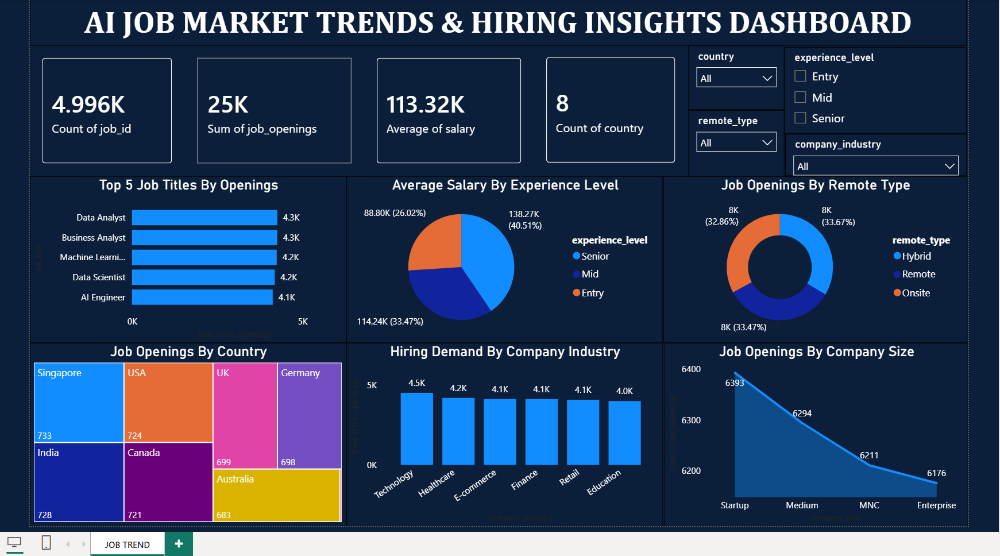

# IT-Job-Market-Trends-Hiring-Insights
Analyzed IT job market data to identify hiring trends, job roles, salary patterns, and key workforce insights. Cleaned and transformed the data using Power Query and created interactive dashboards with KPIs, charts, and slicers.

## Project Overview

Analyzed IT job market data using Power BI to identify hiring trends, job roles, and key insights.

## Tools Used

- Power BI
- Power Query
- DAX
- Data Cleaning
- Data Visualization

## Dashboard

